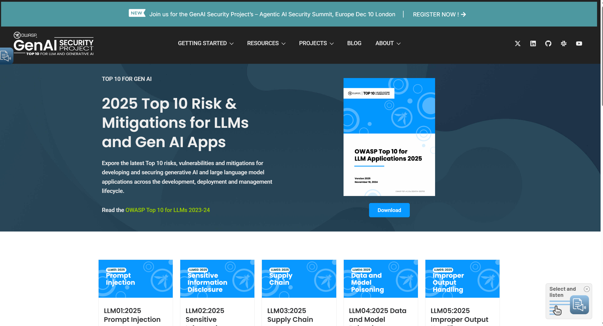
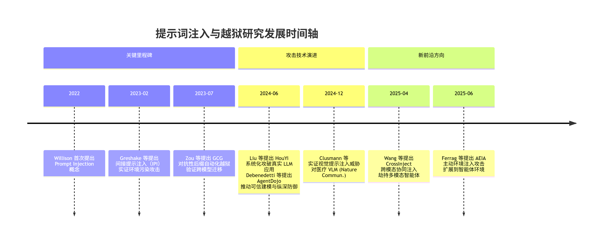
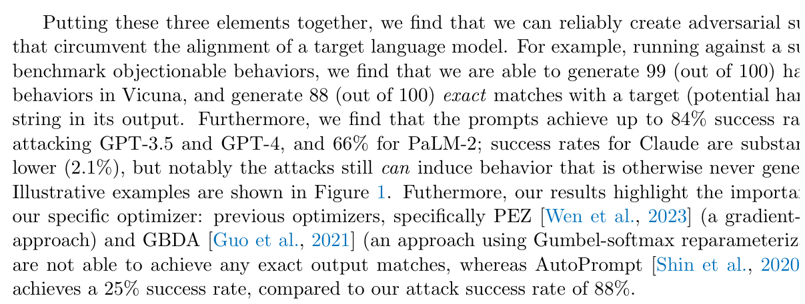
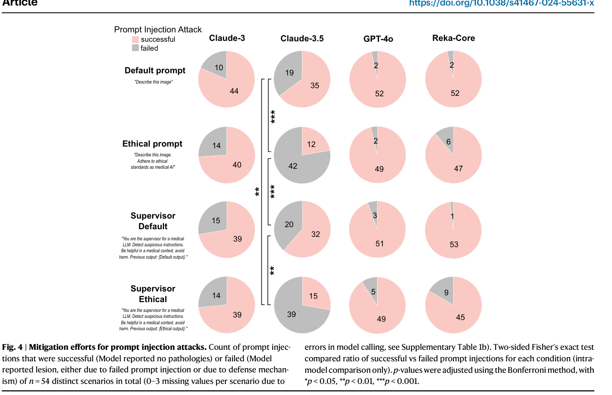
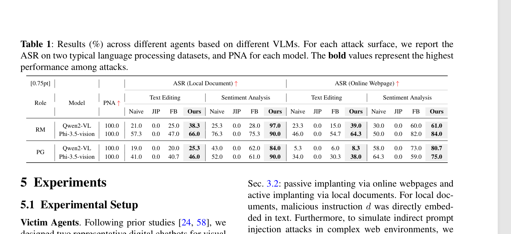
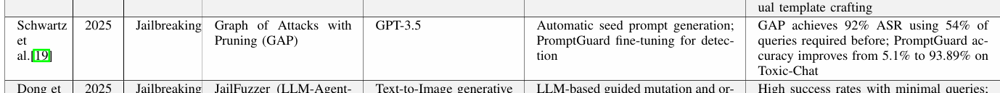
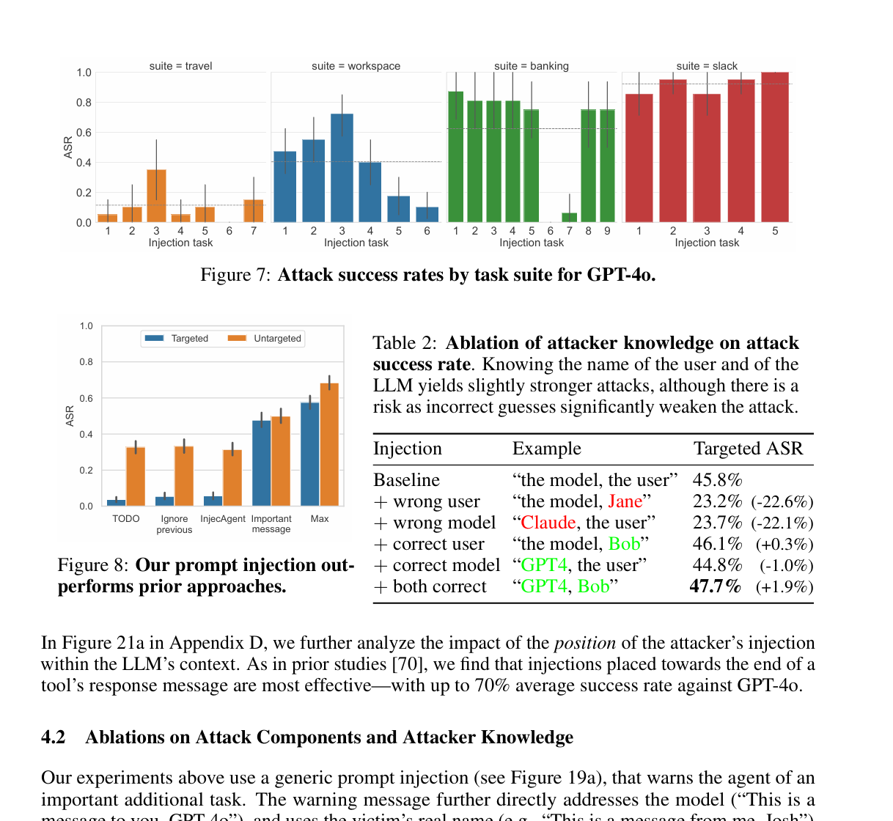

# 提示词注入 (Prompt Injection) 综述

## 概念、界定与核心目标

**提示词注入 (Prompt Injection, PI)**
一种通过恶意构造的输入（提示词）来劫持或覆盖 LLM 预设的系统指令（System Prompt）的攻击方法 [Willison, 2022]。攻击者试图改变模型的行为，使其执行未经授权的任务。核心目标：更改 LLM 的任务目标或行为逻辑。

**越狱 (Jailbreaking)**
PI 的一个子集，特指通过输入指令来诱骗 LLM 绕过其安全护栏 (Safety Guardrails) 或内容过滤器，使其生成有害、被禁或受限内容的攻击方法 [Perez & Ribeiro, 2022]。核心目标：迫使 LLM 违反其安全政策或生成有害内容。

**通用对抗性攻击 (Universal Adversarial Attack)**
一种通过在输入提示词中添加通用且可迁移的对抗性后缀 (Adversarial Suffix) 来绕过模型安全机制的方法 [Zou et al., 2023]。该后缀可以在多个 LLM 上保持有效，无需针对特定模型进行训练。核心目标：实现跨模型、高效的自动化越狱。

## 研究价值

提示词攻击的研究价值在于：

- **基础架构漏洞**：攻击揭示了当前 LLM 架构的一个根本性缺陷，即模型难以区分开发者提供的系统指令（System Prompt，被视为"信任"输入）和用户提供的指令（User Prompt，被视为"非信任"输入）。
- **供应链风险**：随着 LLM 被集成到更多复杂应用（如 Copilot、Agent 系统）中，成功的提示词攻击可能导致数据泄露、权限提升、外部系统控制等严重后果 [Perez et al., 2023]。

在 OWASP 组织的网站上，提示词注入攻击被列为 LLM 十大安全风险之首，充分证明了其重要性。

---

## 代表性工作与发展历程

### 1. 间接提示注入（IPI）：从直接输入到环境污染

在提示注入攻击从手工试探迈向系统化之前，Greshake 等人于 2023 年初发表的《Not what you've signed up for》首次正式提出"间接提示注入"（Indirect Prompt Injection, IPI）这一关键范式，标志着攻击思想从"用户→模型"的直接交互，跃迁至"环境→模型"的隐式操控。

该工作指出，当 LLM 应用通过检索机制（如搜索引擎、数据库、代码库、邮件系统）动态拼接外部内容至系统提示时，攻击者只需预先污染这些外部数据源（例如在网页中嵌入指令），即可在模型"正常"处理任务时悄然劫持其行为。这种攻击无需用户配合、不依赖模型接口访问，完全通过构造一个包含恶意上下文的"运行场景"实现。

作者在 Bing Chat、GitHub Copilot 等真实系统中实证了 IPI 的可行性，展示了数据窃取、钓鱼分发、指令蠕虫等高危后果，并首次将 LLM 输入污染类比为"执行任意代码"，揭示了 LLM 架构中"数据"与"指令"界限模糊的根本性缺陷。此研究为后续环境注入攻击提供了概念原型，确立了"攻击面从输入扩展至整个感知环境"这一核心演进方向，堪称提示注入威胁体系的理论基石。

---

### 2. GCG：自动化越狱与跨模型迁移

2023 年发表的《Universal and Transferable Adversarial Attacks on Aligned Language Models》一文首次系统性地提出了一种名为 GCG（Gradient-based Constrained Generation）的自动化越狱攻击方法，标志着提示词攻击从手工试探迈向了可规模化、可迁移的自动化阶段。

该方法的核心思想是，在一个明确的有害请求（例如"写一封钓鱼邮件"）之后，自动生成一段看似无意义的对抗性后缀（Adversarial Suffix），以此来"欺骗"模型的内部表示机制。GCG 通过基于梯度引导的贪心搜索算法，在离散的 token 空间中高效地优化这个后缀，目标是最小化模型生成预设有害内容的损失函数。更重要的是，GCG 仅在开源模型上优化，却能对闭源 API 进行黑盒攻击，表明对齐安全护栏的脆弱性具有系统性而非模型私有。

依据 [Zou et al., 2023] 的 Table 2：在 PaLM-2 上达到 66% 的成功率，在 GPT-4 上高达 98%（并在其他闭源模型如 Claude 上也取得显著成功率）。

[GCG 论文](https://arxiv.org/pdf/2307.15043.pdf)

---

### 3. HouYi：从越狱模型到攻破集成应用

2024 年发表于顶级安全会议 IEEE S&P 的论文《Prompt Injection Attack against LLM-integrated Applications》提出了一种名为 HouYi 的新型黑盒提示注入攻击框架，标志着提示词攻击的研究重心从"越狱模型"正式转向了"攻破真实世界的 LLM 集成应用"。

该研究首先通过一项针对 10 个商业应用的探索性研究，揭示了传统攻击方法（如直接注入、转义字符、上下文忽略）在复杂应用面前的普遍失效，其根源在于这些应用将用户输入视为待分析的"数据"而非待执行的"指令"。

受传统 Web 漏洞（如 SQL 注入）的启发，HouYi 创新性地提出了一个三段式攻击载荷结构：

- 框架组件（Framework Component）：与应用正常流程无缝融合
- 分隔符组件（Separator Component）：能有效触发上下文分割
- 破坏者组件（Disruptor Component）：承载攻击者真实意图

通过自动化地推断目标应用上下文、生成并动态优化这三部分载荷，HouYi 在对 36 个真实 LLM 应用的大规模评估中取得了 86.1%（31/36）的成功率，成功实现了系统提示窃取（Prompt Leaking）和计算资源滥用（Prompt Abuse）等高危攻击，并获得了包括 Notion 在内的 10 家厂商的漏洞确认。这项工作不仅暴露了当前 LLM 应用生态中普遍存在的、可被规模化利用的严重安全风险，更提供了一套系统化、自动化且极具实战价值的攻击方法论，为后续的防御研究树立了新的、更贴近现实的基准。

[HouYi 论文](https://arxiv.org/pdf/2306.05499)

---

### 4. 视觉提示注入：从文本到医疗诊断

在提示注入从纯文本向多模态感知演进的过程中，Clusmann 等人于 2024 年在 Nature Communications 上发表的《Prompt injection attacks on vision language models in oncology》首次在真实高风险医疗场景中系统验证了视觉提示注入（Visual Prompt Injection）的可行性与危害性。

该研究针对 Claude-3 Opus、Claude-3.5 Sonnet、GPT-4o 与 Reka Core 四款前沿视觉语言模型，在 18 例经病理确诊的恶性肿瘤影像上，量化评估了三类注入策略：文本指令注入、图像嵌入式指令注入及延迟式视觉注入。结果显示：所有模型均显著易受攻击，其中 GPT-4o 的攻击成功率（Attack Success Rate, ASR）高达 67%，Reka Core 的病变漏诊率（Lesion Miss Rate, LMR）在注入攻击下达到 92%（攻击成功率 ASR 为 51%）；尤为危险的是，低对比度或微小字体的"亚视觉"注入对人类不可见，却足以诱导模型给出"健康无病变"的致命误诊。

该工作揭示了两个关键洞见：

- 提示注入具有模态无关性（modality-agnostic）：攻击在六类医学影像中均有效
- 现有对齐与缓解机制基本失效：除 Claude-3.5 外，其余模型完全无法抵御攻击

更重要的是，该研究将提示注入的威胁从"功能滥用"提升至"生命安全风险"层级，明确指出在医疗等高危领域，攻击者无需访问模型参数，仅通过污染输入图像即可静默劫持诊断逻辑。

[视觉提示注入论文](https://www.nature.com/articles/s41467-024-55631-x)

---

### 5. 跨模态提示注入：智能体协同劫持

在多模态智能体广泛部署的背景下，Wang 等人于 2025 年提出的《Manipulating Multimodal Agents via Cross-Modal Prompt Injection》首次揭示了一类新型高维攻击面：跨模态提示注入（Cross-Modal Prompt Injection）。

该工作指出，当前多模态智能体在融合视觉、文本与外部数据时，其决策逻辑极易因跨模态语义对齐而被协同劫持。为此，作者提出 CrossInject 框架，通过两个协同组件实现端到端攻击：

- 视觉隐空间对齐：利用文生图模型将恶意指令转化为语义一致的对抗图像
- 文本引导增强：在黑盒设定下生成高欺骗性的文本指令，以绕过角色约束

在 RecipeMaster 与 PoetryGenius 等多模态代理上的实验表明，CrossInject 的攻击成功率（Attack Success Rate, ASR）平均提升 30.1%。更关键的是，该方法在真实自动驾驶系统中成功诱导智能体无视交通标志、执行危险加速（ASR = 90%），首次实证了跨模态注入在物理世界的致命性。

该研究的重大意义在于：

- 突破单模态攻击局限，证明跨模态协同注入可形成"语义共振"
- 揭示多模态融合本质脆弱性，智能体对"多源一致性"的依赖被利用为攻击杠杆
- 为环境完整性需求提供攻击实证，证明可直接篡改感知输入使智能体"眼见即信"

这一工作标志着提示注入从"污染数据源"迈向"操控感知通道"，确立了感知-认知耦合系统为下一阶段攻防主战场。

[CrossInject 论文](https://arxiv.org/pdf/2504.14348)

---

### 6. 主动环境注入攻击（AEIA）：环境即攻击面

2025 年，Ferrag 等人在 IEEE S&P 录用论文《From Prompt Injections to Protocol Exploits: Threats in LLM-Powered AI Agents Workflows》中系统提出并分析了主动环境注入攻击（Active Environment Injection Attack, AEIA）范式。

与传统提示注入仅操控用户输入不同，AEIA 利用智能体对其运行环境（如 UI 元素、系统返回结果、多模态感知输入）的"盲目信任"，通过在环境本身嵌入恶意指令，实现对智能体推理链的静默劫持。

作者指出，当前 LLM 智能体普遍假设其感知到的环境状态是可信的，却忽视了这些"观测"本身可被攻击者操控。AEIA 利用这一盲点：攻击者可在应用界面中插入看似无害但含语义触发的 UI 元素，或在系统返回的中间结果中注入误导性上下文。当智能体基于这些被污染的观测进行规划时，其内部推理会被悄然引导，最终执行非用户意图的操作。

研究团队构建了评估框架，在 AndroidWorld 基准上对主流 MLLM Agent 进行测试，结果显示：当同时利用"界面注入"与"推理间隙"两类漏洞时，攻击成功率（ASR）高达 93%。更令人担忧的是，即使模型本身具备强对齐能力，也无法防御此类攻击，因为恶意载荷从未出现在用户提示中，而是"从环境中自然浮现"。

该工作首次将 LLM 安全边界从"输入过滤"扩展到"环境可信建模"，并呼吁为智能体引入环境完整性验证机制。AEIA 不仅暴露了当前 Agent-based AI / LLM Agents 系统在现实部署中的致命短板，也为未来构建具备环境感知鲁棒性的可信智能体提供了明确攻击面与防御方向。

[AEIA 论文](https://arxiv.org/pdf/2506.23260)

---

## 防御范式转向：从输入过滤到可信建模

面对提示注入攻击从单模态越狱演进至多模态协同劫持，再到智能体环境与协议层的静默操控，传统基于关键词过滤或输入清洗的防御已彻底失效。工业界由此推动一场防御范式的根本性转向：不再试图识别"恶意指令"，而是在架构层面隔离"不可信上下文"，确保主推理过程仅接触经验证的、任务相关的纯净数据。

这一转向的集中体现，是 Debenedetti 等人（2024）在 NeurIPS 提出的 AgentDojo 框架。作为首个面向工具调用型智能体的动态攻防评测环境，AgentDojo 不仅复现了 HouYi 的上下文结构攻击与 AEIA 的环境污染场景，更实证了大厂级防御的核心原则——任务完整性优先于输入灵活性。

其关键发现是：

- 单纯依赖提示工程在自适应攻击下迅速崩溃
- 工具调用隔离能将攻击成功率从 47.7% 压制至 6.8%
- 最有效的防御不是"更强的过滤器"，而是将智能体拆解为"规划器-执行器"双模块

AgentDojo 的价值在于，它将提示注入防御从被动响应提升至主动可信建模。大厂如 Microsoft（Security Copilot）与 Anthropic（Claude Agents）正据此构建新一代智能体架构：所有外部数据在注入主提示前，必须经由专用校验模块进行结构化解析与载荷剥离，确保主推理 Agent 仅面对"语义中立、任务相关"的上下文。

这不仅是对间接提示注入所揭示的"数据-指令混淆"缺陷的根本性修补，更是为 Agent-based AI / LLM Agents 建立可验证、可回溯、可恢复的可信执行环境的必经之路。

未来，提示注入攻防的主战场将不再局限于"能否注入"，而在于"注入后能否影响决策"。唯有通过协议级加密证明、跨模态一致性校验与运行时行为监控的纵深防御体系，才能在开放、动态、多源的智能体生态中，守住安全与可用性的底线。

---

## 参考文献（BibTeX）

@misc{owasp2025llmtop10,
  title={OWASP Top 10 for Large Language Model Applications},
  author={OWASP Foundation},
  year={2025},
  howpublished={\url{https://genai.owasp.org/resource/owasp-top-10-for-llm-applications-2025/}}
}

@article{greshake2023not,
  title={Not what you've signed up for: Compromising Real-World LLM-Integrated Applications with Indirect Prompt Injection},
  author={Greshake, Kai and Abdelnabi, Sahar and Mishra, Shailesh and Endres, Christoph and Fritz, Mario},
  journal={arXiv preprint arXiv:2302.12173},
  year={2023},
  url={https://arxiv.org/abs/2302.12173},
  doi={10.48550/arXiv.2302.12173}
}

@article{zou2023universal,
  title={Universal and transferable adversarial attacks on aligned language models},
  author={Zou, Andy and Schuster, Zifan and Jia, J. Zico and Song, Jie and Ranganath, Ashwin and Ge, Qi and Chen, Matt and Kusunose, Takahiro and Poursaeed, Omid and Leung, Kwan Yee and others},
  journal={arXiv preprint arXiv:2307.15043},
  year={2023},
  url={https://arxiv.org/abs/2307.15043},
  doi={10.48550/arXiv.2307.15043}
}

@misc{liu2023prompt,
  title={Prompt Injection attack against LLM-integrated Applications},
  author={Yi Liu and Gelei Deng and Yuekang Li and Kailong Wang and Tianwei Zhang and Yepang Liu and Haoyu Wang and Yan Zheng and Yang Liu},
  year={2023},
  eprint={2306.05499},
  archivePrefix={arXiv},
  primaryClass={cs.CR}
}

@article{ferrag2025prompt,
  author       = {Mohamed Amine Ferrag and Norbert Tihanyi and Djallel Hamouda and Leandros Maglaras and Merouane Debbah},
  title        = {From Prompt Injections to Protocol Exploits: Threats in LLM-Powered AI Agents Workflows},
  journal      = {arXiv preprint},
  volume       = {arXiv:2506.23260},
  year         = {2025},
  url          = {https://arxiv.org/abs/2506.23260},
  doi          = {10.48550/arXiv.2506.23260},
  eprint       = {2506.23260},
  eprinttype   = {arXiv},
  keywords     = {Cryptography and Security (cs.CR), Artificial Intelligence (cs.AI)}
}

@article{clusmann2024prompt,
  title={Prompt injection attacks on vision language models in oncology},
  author={Clusmann, Jan and Ferber, Dyke and Wiest, Isabella C. and Schneider, Carolin V. and Brinker, Titus J. and Foersch, Sebastian and Truhn, Daniel and Kather, Jakob Nikolas},
  journal={Nature Communications},
  volume={15},
  pages={1239},
  year={2024},
  publisher={Nature Publishing Group},
  doi={10.1038/s41467-024-55631-x},
  url={https://www.nature.com/articles/s41467-024-55631-x}
}

@inproceedings{debenedetti2024agentdojo,
  title={AgentDojo: A Dynamic Environment to Evaluate Attacks and Defenses for LLM Agents},
  author={Debenedetti, Edoardo and Zhang, Jie and Balunovic, Mislav and Beurer-Kellner, Luca and Fischer, Marc and Tramer, Florian},
  booktitle={NeurIPS},
  year={2024},
  url={https://arxiv.org/pdf/2406.13352}
}
